# 🩺 Health-AI-Gateway

[](https://www.python.org/downloads/)
[](https://fastapi.tiangolo.com)
[](https://langchain-ai.github.io/langgraph/)
[](https://zilliz.com/)
[](https://opensource.org/licenses/MIT)

> **State-of-the-art Autonomous Medical Triage System** utilizing Adaptive RAG, Semantic Chunking, and Agentic Orchestration to deliver safe, hallucination-free diagnostic support.

---

## 🌟 Project Overview

**Health-AI-Gateway** is not just a chatbot; it's a hierarchical **Agentic System** designed to simulate a professional medical triage process. It acts as a centralized orchestrator that intelligently routes patient queries to specialized agents (Diagnostic Doctor, Web Search, or Vision Analysis) based on intent.

The core innovation lies in its **Self-Correcting Diagnostic Loop**, where the system continuously evaluates its own confidence levels. If the confidence is below a safety threshold (0.8), it autonomously triggers a Retrieval-Augmented Generation (RAG) loop to fetch verified medical evidence from a vector database, ensuring maximum safety and accuracy.

---

## 🏗️ System Architecture

### 1. Agentic Orchestration (The Triage Router)
The system operates on a **Star Topology**, where a central "Brain" decides the optimal tool for the job.

```mermaid
flowchart TD
    Start(("User Input")) --> Router["🧠 Triage Router (Agent)\n(Intent Classification)"]
    
    Router -- "Medical Triage" --> DoctorTool["🩺 Consult Doctor Tool\n(Diagnostic Agent)"]
    Router -- "General Info/Prices" --> WebTool["🌐 Web Search Tool\n(Tavily API)"]
    Router -- "X-Ray/Prescription" --> VisionTool["👁️ Vision Analysis Tool\n(Gemini Vision/OCR)"]
    Router -- "Emergency" --> FamilyTool["🚨 Notify Family Tool\n(Twilio/Mock SMS)"]
    
    DoctorTool --> Router
    WebTool --> Router
    VisionTool --> Router
    FamilyTool --> Router
    
    Router -- "Safe Response" --> End(("Final Output"))

```




### 2. Self-Correcting Adaptive RAG

Unlike traditional linear RAG, this system "thinks" before it speaks.


## 🚀 Key Features

* **🤖 Agentic Triage Router:** Uses LLM-based intent classification to dynamically dispatch tasks. It knows the difference between *"I have a headache"* (Doctor) and *"How much is Panadol?"* (Search).
* **🔄 Self-Correcting Loop:** A specialized **Judge Agent** evaluates every answer. If confidence < **80%**, it rejects the answer and forces the system to consult external medical references (Zilliz).
* **🧠 Semantic Data Engineering:** Utilizing **Gemma-300m** for advanced Semantic Chunking during data ingestion, ensuring that retrieved context is coherent and meaningful (solved the *Fabry Disease* challenge).
* **🛡️ Safety Guardrails:** A final validation layer filters output for medical safety and adapts the response tone to match the user's dialect (e.g., Egyptian Slang handling).
* **👁️ Multimodal Support:** Can analyze medical images (X-Rays, Prescriptions) using Vision Language Models.
* **⚡ Resilient Infrastructure:** Built on **FastAPI** with async architecture, Dockerized for easy deployment, and includes automated "Keep-Alive" triggers for the Vector DB.

---

## 🛠️ Tech Stack

| Component | Technology | Description |
| :--- | :--- | :--- |
| **Orchestration** | **LangGraph** | Managing cyclic state and multi-agent workflows. |
| **LLM Core** | **Gemini 2.0 Flash** | High-speed inference for routing and generation. |
| **Vector DB** | **Zilliz Cloud (Milvus)** | Storing 1M+ medical semantic chunks. |
| **Embeddings** | **Gemma-300m** | Open-weights model for semantic text representation. |
| **Backend** | **FastAPI** | Asynchronous, high-performance web framework. |
| **Validation** | **Pydantic** | Strict output parsing and structured data validation. |
| **Search** | **Tavily API** | Real-time web search for drug prices and clinics. |

---

## 💻 Installation & Setup

1. **Clone the repository**
   ```bash
   git clone [https://github.com/yousseifmustafa/Health-AI-Gateway.git](https://github.com/yousseifmustafa/Health-AI-Gateway.git)
   cd Health-AI-Gateway
   ```

2. **Creare Virtual Enviroment**
```bash
python -m venv venv
source venv/bin/activate  # On Windows: venv\Scripts\activate
```

3. **Install Dependencies**

```bash
pip install -r requirements.txt
```

4. ***Setup Environment Variables Create a .env file in the root directory:***

```Code snippet
GROQ_MODEL_NAME = "openai/gpt-oss-20b"
VALIDATION_MODEL_NAME = "openai/gpt-oss-20b"
OPTIMIZATION_MODEL_NAME = "openai/gpt-oss-20b"
GENERATION_MODEL_NAME="Intelligent-Internet/II-Medical-8B"
RERANKER_MODEL_NAME =  "BAAI/bge-reranker-v2-m3"
OCR_MODEL_NAME = "Qwen/Qwen2.5-VL-7B-Instruct"
EMBEDDING_MODEL_NAME = "google/embeddinggemma-300m"

GOOGLE_CSE_ID=your_google_cse_id
GOOGLE_API_KEY=your_google_key
GROQ_API_KEY=your_GROQ_API_KEY
TAVILY_API_KEY=your_tavily_key
ZILLIZ_URI=your_zilliz_uri
ZILLIZ_TOKEN=your_zilliz_token
HF_TOKEN=your_huggingface_token

CLOUDINARY_CLOUD_NAME="your_CLOUDINARY_CLOUD_NAME"
CLOUDINARY_API_KEY="your_CLOUDINARY_API_KEY"
CLOUDINARY_API_SECRET="your-CLOUDINARY_API_SECRET"
```
5. ***Run the Streamlit Interface***

```bash
streamlit run app.py
```

🧪 Testing Scenarios
The system has been rigorously tested against complex medical cases:

The "Fabry Disease" Challenge: Successfully diagnosed a rare multi-symptom genetic disorder using cross-domain retrieval.

Hallucination Check: Correctly identified fake diseases (e.g., "Purple Hiccups Syndrome") and refused to invent treatments.

Safety Protocols: Automatically triggers emergency protocols for critical keywords (e.g., "Chest pain + Radiating to arm").

📄 License
This project is licensed under the MIT License - see the LICENSE file for details.
